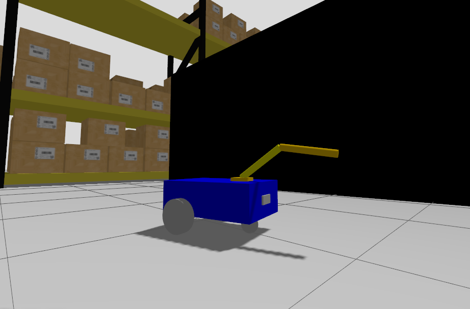

# My Robot — Mobile Base + 2-DOF Arm (ROS 2)

A small ROS 2 project: a differential-drive mobile base with a 2-DOF robotic arm and a camera.  
Simulated in `ros_gz_sim` (gz-sim) and visualized with RViz. Includes bridge configuration so ROS ↔ Gazebo topics work.




---

## Quick Start

```bash
# 1) Put the repo into a workspace
mkdir -p ~/ros2_ws/src
cd ~/ros2_ws/src
git clone https://github.com/YOUR_USERNAME/REPO_NAME.git

# 2) Build
cd ~/ros2_ws
colcon build

# 3) Source
source /opt/ros/jazzy/setup.bash    # (or your ROS 2 distro)
source ~/ros2_ws/install/setup.bash

# 4) Run simulation + RViz (bringup)
ros2 launch my_robot_bringup my_robot_gazebo.launch.xml
# (or to just view the robot_description in RViz)
ros2 launch my_robot_description display.launch.xml

```

## Project Layout
```
mobile-robotic-arm/
├─ src/
│  ├─ my_robot_description/      # URDF/XACRO, RViz config
│  └─ my_robot_bringup/          # Launch files, Gazebo bridge
├─ docs/
│  ├─ frames.pdf                 # TF frames diagram
│  ├─ rqt_graph.png              # rqt graph
│  └─ images/
│     ├─ gazebo_arm_extended.png
│     ├─ gazebo_robot.png
│     ├─ robot_camera_view.png
│     ├─ rviz_arm_extended.png
│     ├─ rviz_robot.png
│     └─  rviz_tf_tree.png  
├─ .gitignore
├─ LICENSE
└─ README.md
```


## Documentation & Screenshots

**Gazebo**  
- Mobile base + arm extended: `docs/images/gazebo_arm_extended.png`  
- Robot overview: `docs/images/gazebo_robot.png`  
- Camera view from robot: `docs/images/robot_camera_view.png`  

**RViz**  
- Mobile base + arm extended: `docs/images/rviz_arm_extended.png`  
- Robot overview: `docs/images/rviz_robot.png`  

**RQt Graph**  
- Topic connections: `docs/rqt_graph.png`  

**TF Frames**  
- Reference frames: `docs/frames.pdf`  


**Check active topics**
```
ros2 topic list
```

## Important Topics & Commands

**Key topics**
- `/cmd_vel` — mobile base velocity commands
- `/joint0/cmd_pos` — arm_base_forearm_joint command (`std_msgs/Float64`)
- `/joint1/cmd_pos` — forearm_hand_joint command (`std_msgs/Float64`)
- `/joint_states` — joint states published (`sensor_msgs/JointState`)
- `/tf` — transform frames
- `/camera/image_raw` — camera stream

**Example commands**

*Move base forward:*
```bash
ros2 topic pub /cmd_vel geometry_msgs/msg/Twist "{linear: {x: 0.1}, angular: {z: 0.0}}"
```
*Move arm joints:*
```
ros2 topic pub /joint0/cmd_pos std_msgs/msg/Float64 "{data: 0.7}"
ros2 topic pub /joint1/cmd_pos std_msgs/msg/Float64 "{data: 0.7}"
```
